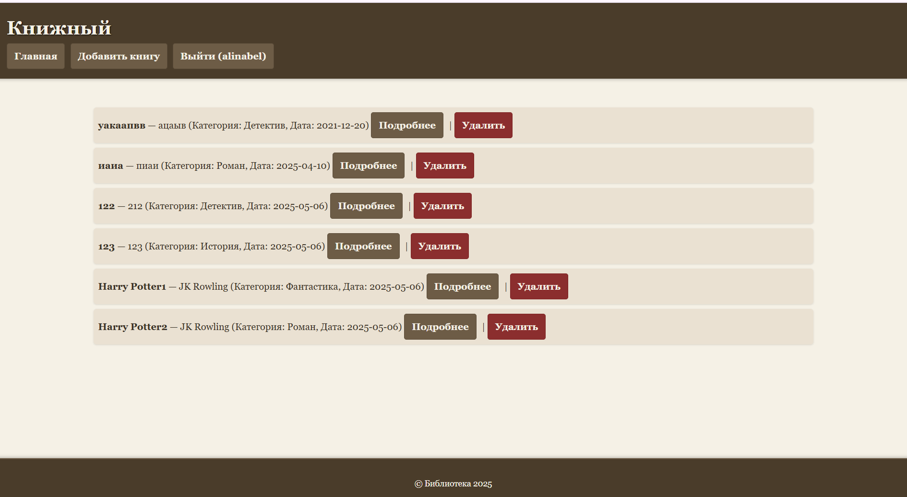

# Отчет по индивидуальной работе
# Книжный каталог

# Авторы
* **Belioglo Alina**
* **Certcov Vladislav**

## Инструкции по запуску проекта
1. Запустите встроенный сервер PHP: `php -S localhost:8080 -t public`
2. Откройте проект в браузере:
Перейдите по адресу `http://localhost:8080`

## Функциональные возможности
Регистрация и авторизация пользователей.
Добавление, удаление и просмотр книг.
Разделение прав доступа (администратор/пользователь).
Категоризация книг.

## Сценарии взаимодействия пользователей и примеры использования проекта

1. Регистрация:
   - Пользователь вводит имя, email и пароль. После успешной регистрации пользователь автоматически авторизуется.

   - Если уже существует пользователь, то выходит след сообщение

2. Авторизация:
   - Пользователь вводит имя и пароль. После успешного входа пользователь перенаправляется на главную страницу.

   - Если не правильно авторизовались, то выходит след сообщение

3. Просмотр книг (для всех пользователей):
   - Пользователь может просматривать список книг и их подробную информацию.

4. Управление книгами (для администратора):
   - Администратор может добавлять новые книги, удалять существующие и просматривать их детали.

   - Подтверждение удаления при помощи экранизации

## Структура базы данных

## Другие важные аспекты
Используются сессии для управления доступом.
Пароли хранятся в виде хэшей для безопасности.
Реализована защита от SQL-инъекций через PDO.
Администраторы управляют книгами, пользователи только просматривают.
Окно подтверждения для удаления книг.
Код разделен на обработчики, шаблоны, миграции и конфигурацию.
